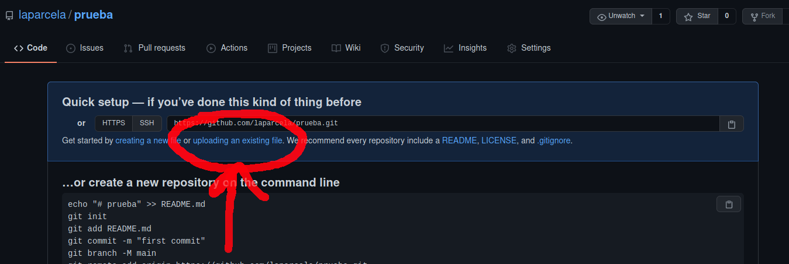

# Instrucciones para subir código a Github

Github es una plataforma donde se puede alojar código. Esto es muy útil ya que todo lo que subamos a Github quedará disponible para que cualquier persona interesada lo consulte. Github utiliza git, el cual es un programa de control de versiones. Este es un programa que puedes instalar en tu computadora y con el que puedes organizar tu proyecto para tener un historial y poder crear diferentes versiones de una forma ordenada (sin necesidad de copiar mil veces los archivos y renombrarlos). Todo lo que se sube a Github es un proyecto de Git, sin embargo, **no es necesario que sepas usar git para subir tu código a Github**.

En este documento se explica cómo puedes subir tu código al repositorio de Github de La parcela.

## Paso 1: Crea un nuevo repositorio de Github

Lo primero que tienes que hacer es crear el lugar donde va a vivir tú proyecto. 

1. Entra a la página de [Github](https://github.com/) y da click en **Iniciar sesión**:

2. Inicia sesión con la cuenta ***laparcela***:

3. En la página de usuario da click en **+** y en **Nuevo repositorio**:

4. Ingresa el nombre de tu repositorio. El nombre no puede incluir espacios vacios ya que este se utilizará en la url de tu proyecto (e.g., `https://github.com/laparcela/AGROECO-POWER-5000`):

5. Agrega opcionalmente una *Descripcion* del proyecto, indica que sea *Publico* para que todos lo puedan ver e inicializa vacio tu repositorio (no agregues un `README`, `.gitignore` ni `licencia`). Y finalmente da click en **Crear repositorio**:

6. ¡Listo has creado el repositorio donde vivirá tu proyecto! Verás la siguiente ventana:

---

## Paso 2: Sube tu código

Existen varias formas para subir tu código. Elige una opción dependiendo tu caso:

- **Caso 1:** "Ya tengo todo listo, no he usado git y solo lo quiero subir mi código de la forma más fácil y rápida posible"
- **Caso 2:** "Ya tengo lo que quiero subir y ya es un proyecto de git"
- **Caso 3:** "Apenas voy a empezar a trabajar pero quiero desde un inicio usar git y Github"

### Caso 1

1. Da click en **subir un archivo existente**:

2. Arrastra todos los archivos y carpetas que quieras subir a tu repositorio:

3. Revisa que se vayan a subir todos los archivos que quieres:

4. Agrega un mensaje de **commit** (algo que describa qué estás haciendo) y da click en **Realizar cambios**:

5. ¡Listo tus archivos ahora están en un repositorio de Github!

6. Es recomendable también agregar un **README** que describa el proyecto. Para eso da click en **Agregar README**:

7. Agrega una descripción de tu modelo. El archivo README se escribe utilizando un lenguaje de marcado llamado Markdown. Este te permite estructurar tu texto para que de manera automática te ponga títulos, subtítulos, negritas, enlaces, etc. Aquí puedes aprende sobre la [sintaxis de Markdown](https://www.markdownguide.org/basic-syntax/).

8. Agrega un mensaje de **commit**, selecciona **Realizar cambios directamente en la rama `main`** y da click en **Realizar cambios**:

9. ¡Listo! Tu proyecto ya incluye un README que se muestra en la entrada de tu repositorio:

10. Copia la url del repositorio, pégala en tu tesis/artículo o compartela con todos tus amigos.

### Caso 2

Proximamente...

### Caso 3

Proximamente...

